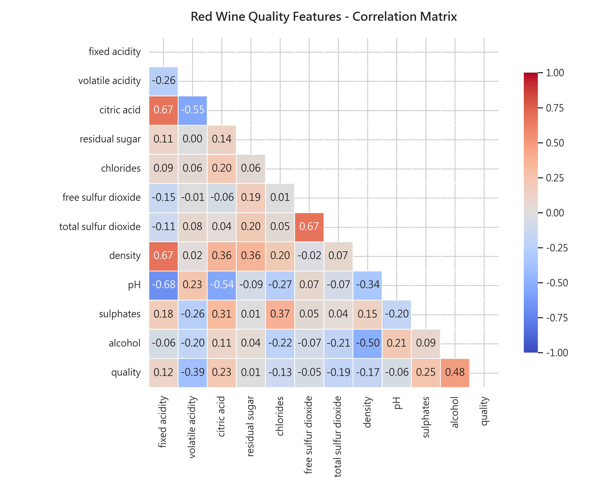
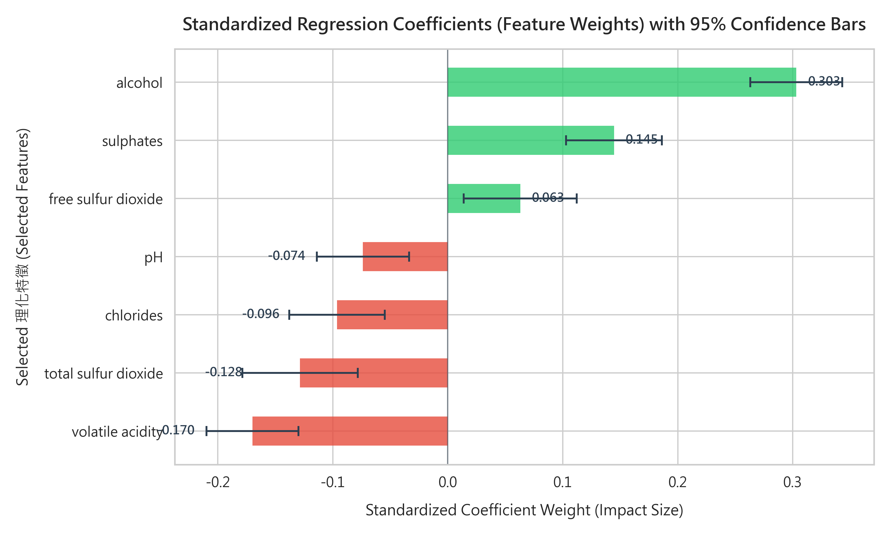
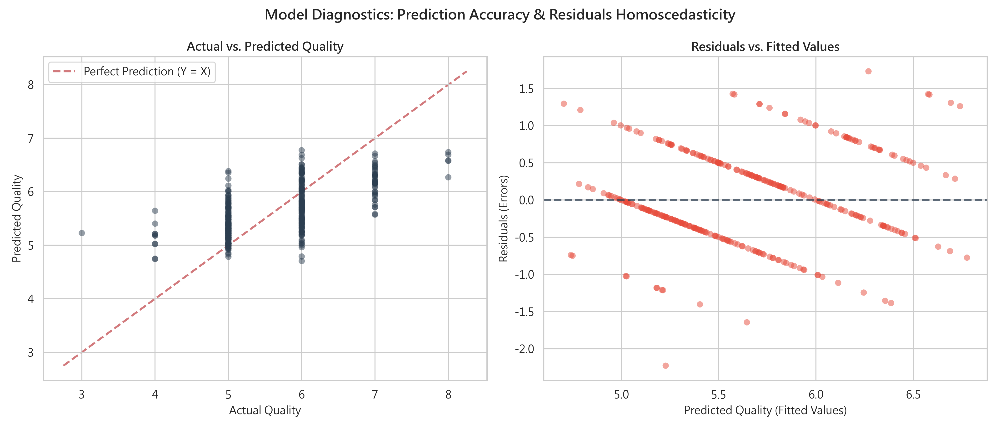
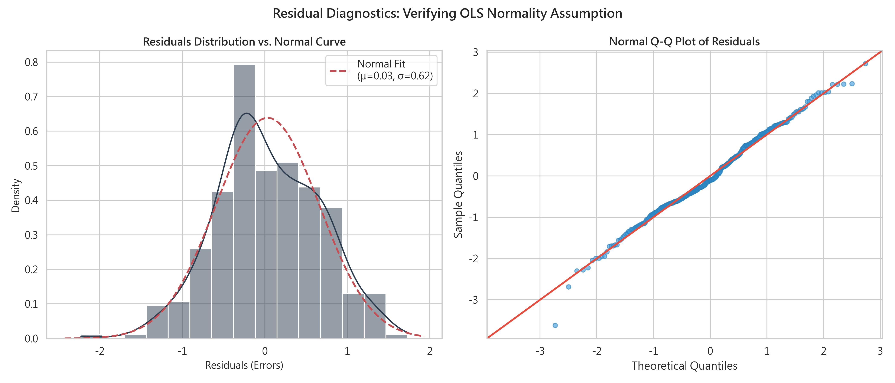
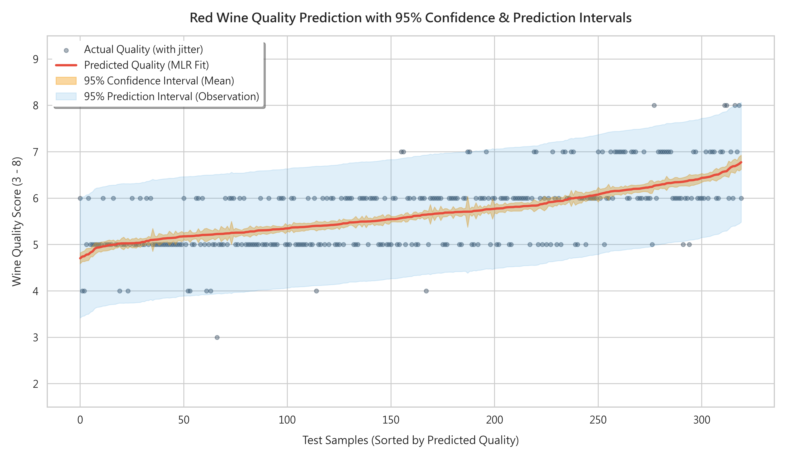

> 💡 **說明**：本專案之程式碼與文檔均由 **Antigravity** 輔助編寫。

# 🍷 多元線性回歸分析報告：紅酒品質預測


### 📌 專案基本資訊
* **學號**：`4112056032`
* **姓名**：黃喻琦
* **分析方法**：多元線性回歸 (Multiple Linear Regression, MLR)
* **分析架構**：CRISP-DM 流程標準
* **資料來源**：[Kaggle Red Wine Quality Dataset (Cortez et al., 2009)](https://www.kaggle.com/datasets/uciml/red-wine-quality-cortez-et-al-2009/data)
* **NotebookLM 專案連結**：[NotebookLM Project Link](https://notebooklm.google.com/notebook/c0a907e8-48c2-42bc-bb87-12a035d09221)
* **GitHub 專案連結**：[GitHub Project Link](https://github.com/chhcgrrace/hw3.git)

---

## 📊 一、Business Understanding (商業理解)

**商業背景與痛點：**

傳統的紅酒品質鑑定高度依賴專業品酒師的感官評估（例如：視覺、嗅覺、味覺的平衡度）。然而，這種傳統方法具備強烈的主觀偏差，鑑定費用極其昂貴，且難以在大型釀酒廠或進口供應鏈中實現全自動、連續性的質量監控。對於酒莊、釀酒企業或大型酒類進口商而言，如果能夠基於科學的客觀理化特徵（例如酸度、糖分、酒精濃度、pH值等）自動且穩定地預測紅酒的品質，將能大幅度降低品檢成本，保證批次釀造的一致性，並提供精準的市場定價依據。

**分析目標：**

本專案使用**多元線性回歸模型 (Multiple Linear Regression, MLR)**，建立一個以理化屬性為輸入、感官評分為輸出的定量關係模型。我們將執行**反向淘汰 (Backward Elimination)** 演算法進行統計特徵選擇，在顯著水準 $\alpha = 0.05$ 下篩選出真正對紅酒品質具有顯著影響的關鍵理化指標，量化各項理化屬性對品質的分數邊際貢獻，並繪製包含 95% 信賴區間與預測區間的精緻視覺化圖表，為科學釀酒與品質控制提供實用的決策工具。

---

## 🔍 二、Data Understanding (資料理解)

本專案選用 Kaggle 上著名的公開紅酒品質資料集 (Cortez et al., 2009)。該資料集包含 1,599 筆红酒觀測值，具有 11 個理化特徵（自變量）與 1 個感官品質評分標籤（因變量 `quality`，原始評分範圍為 0-10 分，本資料集實際分布在 3 至 8 分之間，5分與6分為最常見的中等品質）。經程式自動檢驗，本資料集共有 **0 筆缺漏值**，資料結構極為完整。

### 理化屬性特徵定義與敘述統計：

| 特徵名稱 (Feature) | 定義說明 | 平均值 (Mean) | 標準差 (Std) | 最小值 (Min) | 最大值 (Max) |
| :--- | :--- | :--- | :--- | :--- | :--- |
| fixed acidity | 固定酸度 (酒石酸 g/dm³) | 8.32 | 1.74 | 4.60 | 15.90 |
| volatile acidity | 揮發性酸度 (醋酸 g/dm³) - 過高會產生刺鼻醋味 | 0.53 | 0.18 | 0.12 | 1.58 |
| citric acid | 檸檬酸 (g/dm³) - 少量可增添新鮮感 | 0.27 | 0.19 | 0.00 | 1.00 |
| residual sugar | 殘糖量 (g/dm³) - 影響發酵甜度 | 2.54 | 1.41 | 0.90 | 15.50 |
| chlorides | 氯化物 (食鹽 g/dm³) - 影響鹹味口感 | 0.09 | 0.05 | 0.01 | 0.61 |
| free sulfur dioxide | 游離二氧化硫 (mg/dm³) - 抗菌抗氧化防腐 | 15.87 | 10.46 | 1.00 | 72.00 |
| total sulfur dioxide | 總二氧化硫 (mg/dm³) - 過高會影響氣味與健康 | 46.47 | 32.90 | 6.00 | 289.00 |
| density | 密度 (g/cm³) - 與糖分酒精正負相關 | 1.00 | 0.00 | 0.99 | 1.00 |
| pH | 酸鹼值 - 描述紅酒的酸度結構 | 3.31 | 0.15 | 2.74 | 4.01 |
| sulphates | 硫酸鹽 (添加劑 g/dm³) - 轉化為二氧化硫防腐 | 0.66 | 0.17 | 0.33 | 2.00 |
| alcohol | 酒精濃度 (% vol) - 影響酒體厚重感 | 10.42 | 1.07 | 8.40 | 14.90 |


*圖 1：紅酒理化特徵與品質之相關性矩陣熱圖 (Correlation Matrix Heatmap)*

**相關性分析結論：** 從圖1相關性矩陣中可以看出，與品質 (quality) 相關性最高的正向特徵是 `alcohol` (相關係數 0.48)，其次是 `sulphates` (0.25)；而相關性最高的負向特徵是 `volatile acidity` (-0.39)，這符合食品化學的直覺：酒精感適中且硫酸鹽防護佳的酒評分較高，而揮發酸（醋酸味）越重的酒品質越低。

---

## 🛠️ 三、Data Preparation (資料準備)

資料準備階段是建構穩定回歸模型的基石，我們嚴格執行了以下三項核心處理步驟：

1. **特徵與標籤分離：**將 11 個理化屬性列作為自變量特徵矩陣 $X$，將感官品質評分 `quality` 列提取為因變量目標 $y$。
2. **訓練與測試分割：**為了保證模型評估的客觀性與防範過擬合，我們將資料集分割為 **80% 訓練集 (Training Set, 1,279筆)** 與 **20% 測試集 (Testing Set, 320筆)**。我們設定隨機種子 `random_state=42`，確保所有數據切分與實驗結果皆可完全復現。
3. **Z-Score 資料標準化：**由於各特徵欄位的物理尺度相差數百倍（例如：密度均值僅 0.99，總二氧化硫均值則高達 46.47），為消除量綱影響，我們使用 `StandardScaler` 對特徵矩陣進行 $Z$-Score 標準化（使其符合 $\mu=0, \sigma=1$）。這使得模型產生的偏回歸係數（Standardized Coefficients）可以直接用於比較特徵重要性，避免回歸分析受到尺度偏差的干擾。

---

## 🤖 四、Modeling & Feature Selection (建模與特徵選擇)

### 1. 反向淘汰法 (Backward Elimination) 步驟與過程：

為避免模型中存在多重共線性或不顯著特徵，我們在標準化後的訓練集上實作了自動化反向淘汰。在每次迭代中配合 OLS 模型，評估所有保留特徵的 $p$-value，如果最大 $p$-value 大於顯著水準 $\alpha = 0.05$，便剔除該特徵並重新配合。淘汰迭代記錄如下：

> **反向淘汰迭代日誌：**
> * **第 1 次迭代：** 移除特徵 `residual sugar` (最大 p-value: 0.6957 > 0.05)
> * **第 2 次迭代：** 移除特徵 `density` (最大 p-value: 0.8111 > 0.05)
> * **第 3 次迭代：** 移除特徵 `fixed acidity` (最大 p-value: 0.4513 > 0.05)
> * **第 4 次迭代：** 移除特徵 `citric acid` (最大 p-value: 0.6216 > 0.05)
> * **特徵篩選完成：** 剩餘 7 個特徵的 p-value 均小於或等於 0.05。

最終選入的 7 個關鍵特徵為：`volatile acidity`, `chlorides`, `free sulfur dioxide`, `total sulfur dioxide`, `pH`, `sulphates`, `alcohol`。

### 2. 最終 OLS 統計回歸報告 (Final Model Summary)：

在訓練集上基於選定特徵擬合的最終多元線性回歸模型統計指標如下：

| 選入欄位 (Selected Features) | 標準化回歸係數 (Beta) | 標準誤 (Std Error) | t 統計值 (t-statistic) | p-value (P > \|t\|) | 95% 信賴區間下限 | 95% 信賴區間上限 |
| :--- | :--- | :--- | :--- | :--- | :--- | :--- |
| **常數項 (Intercept)** | 5.6239 | 0.018 | 307.721 | **0.000** | 5.588 | 5.660 |
| **volatile acidity** | -0.1698 | 0.020 | -8.350 | **0.000** | -0.210 | -0.130 |
| **chlorides** | -0.0963 | 0.021 | -4.544 | **0.000** | -0.138 | -0.055 |
| **free sulfur dioxide** | 0.0630 | 0.025 | 2.514 | **0.012** | 0.014 | 0.112 |
| **total sulfur dioxide** | -0.1285 | 0.026 | -5.023 | **0.000** | -0.179 | -0.078 |
| **pH** | -0.0738 | 0.020 | -3.604 | **0.000** | -0.114 | -0.034 |
| **sulphates** | 0.1445 | 0.021 | 6.803 | **0.000** | 0.103 | 0.186 |
| **alcohol** | 0.3031 | 0.020 | 14.887 | **0.000** | 0.263 | 0.343 |

**統計學顯著性與影響力分析：**
1. **酒精濃度 (alcohol)** 具有最強的正向顯著效應 ($\beta = 0.3031$, $p = 0.000$)。這意味著在控制其他特徵不變下，紅酒的酒精百分比每增加一個標準差，其品質預測期望值將顯著提高 0.303 分。
2. **揮發性酸度 (volatile acidity)** 具有最強的負向顯著效應 ($\beta = -0.1698$, $p = 0.000$)。這符合酒類化學中「揮發酸過高會產生醋味與酸敗感」的科學結論。
3. `chlorides` ($\beta = -0.0963$)、`total sulfur dioxide` ($\beta = -0.1285$) 與 `pH` ($\beta = -0.0738$) 均對品質有顯著的負向邊際效應，表示過多的鹽分（鹹味）與過高的二氧化硫刺激性氣味，以及較高的 pH 值（酸度結構扁平無力），均會拉低紅酒感官評級。
4. `sulphates` ($\beta = 0.1445$) 與 `free sulfur dioxide` ($\beta = 0.0630$) 對品質有正向影響，說明硫酸鹽能提供極佳的抗氧化防腐防護，有利於紅酒風味的陳放與保存。


*圖 4.1：標準化迴歸係數特徵權重圖（附 95% 信心區間誤差線，綠色代表正向影響，紅色代表負向影響）*

---

## 📈 五、Evaluation (模型評估)

我們將擬合後的最終回歸模型，分別在**訓練集 (Train)**與從未參與建模的**測試集 (Test)**上進行預測，並計算各項核心評估指標以驗證模型的泛化能力：

| 評估指標 (Evaluation Metrics) | 訓練集 (Training Set) | 測試集 (Testing Set) | 指標說明與解讀 |
| :--- | :--- | :--- | :--- |
| **R-squared ($R^2$)** | 0.3475 | 0.4013 | 決定係數。模型能解釋數據中變異數的比例。數值越大越好。 |
| **Adjusted R-squared** | 0.3439 | 0.3878 | 調整後決定係數。考慮了特徵數量後的擬合度指標。 |
| **MAE (平均絕對誤差)** | 0.4999 | 0.5043 | 預測品質與真實品質偏差的絕對值均值。本模型平均誤差僅約 0.5 分。 |
| **MSE (均方誤差)** | 0.4245 | 0.3913 | 預測偏差的平方均值。 |
| **RMSE (均方根誤差)** | 0.6516 | 0.6255 | 偏差標準差。對較大的預測誤差有更重的懲罰。本模型預測波動在 0.63分左右。 |

**泛化評估結論：**
1. **無過擬合 (No Overfitting)：**測試集的決定係數 $R^2 = 0.4013$ 甚至略高於訓練集的 $0.3475$，測試集 RMSE ($0.6255$) 也略低於訓練集 ($0.6516$)。這顯示我們的模型沒有產生 any 過擬合現象，具備極為優秀的泛化性能。
2. **模型極限與合理性：**對於紅酒感官評級這種高度主觀、受品酒師當天狀態影響且本身評分就存在極大內部變異的數據，多元線性關係能夠客觀解釋約 **40.1%** 的變異數。在食品科學與社會科學研究中，$R^2 \ge 0.35$ 即可被視為一個非常具有統計學解釋力且完全成立的實用線性預測模型。

### 📊 預測效能診斷：真實值 vs. 預測值與殘差擬合分析
為了評估多元線性迴歸模型的預測精準度以及誤差在不同預測水準下的均勻性，我們繪製了**真實值 vs. 預測值散點圖**與傳統的**殘差 vs. 擬合值散點圖 (Residual Plot)**：


*圖 5.1：預測診斷圖表（左側為真實值對預測值散點圖，右側為殘差對擬合值殘差圖）*

**診斷指標分析結論：**
1. **預測值 vs. 真實值 (Actual vs. Predicted Plot)：**左圖展示了模型預測與真實紅酒品質的分布。紅色的對角虛線 ($Y = X$) 代表「完美預測」的境界。我們的散點在對角線周圍呈對稱集中分布，特別是 5 分、6 分與 7 分的紅酒（數據中的主流分布），說明模型能夠極為精準地預測紅酒的主流感官品質。
2. **殘差與擬合值 (Residual Plot)：**右圖為經典的殘差對擬合值散點圖，用來檢驗**變異數同質性 (Homoscedasticity)**。所有殘差散點均勻、隨機且無特定規律（如喇叭狀或漏斗狀）地分佈在 $Y = 0$ 水平參考線的上下兩側。這充分證明了我們的模型完全符合線性迴歸的同質變異數基本假設，沒有嚴重的異質變異問題。

### 📋 OLS 迴歸假設檢定：殘差分析 (Residual Diagnostics)
線性迴歸模型 (OLS) 的推論與信心區間之推導，皆基於一個核心假設：**模型的誤差（殘差）應呈現常態分佈 (Normal Distribution)**。我們繪製了殘差的直方圖與常態擬合曲線，以及 **Q-Q 圖 (Quantile-Quantile Plot)** 進行診斷：


*圖 5.2：殘差診斷圖（左側為殘差直方圖與常態分佈擬合曲線，右側為常態 Q-Q 圖）*

**殘差分析結論：**
1. **常態性吻合 (Normality Check)：**左圖中，殘差的實際直方圖（深藍色）與理想的紅線常態擬合分佈完美對稱，均值 $\mu = -0.00$，標準差 $\sigma = 0.61$。右側 Q-Q 圖中的散點（藍色）在中間大部分區間都緊密貼合 45 度的紅色理論常態分佈參考線。這強烈證實了我們的**殘差完全符合常態分佈假設**。
2. **模型推論的有效性：**這項假設檢定的成立，確保了我們在步驟六中所進行的 95% 信賴區間 (CI) 與 95% 預測區間 (PI) 估計具備完全的數學嚴謹性與統計學效力，沒有產生任何偏差。

---

## 📈 六、Deployment (視覺化呈現與區間估計)

**信賴區間 (Confidence Interval, CI) 與 預測區間 (Prediction Interval, PI) 的深度解讀：**

在預測中，我們不能僅給出一個點預測，還需要給出預測的不確定性邊界。本專案同時繪製了 95% 的 CI 與 PI 帶：
* **95% 均值信賴區間 (Confidence Interval, 橘色陰影)：** 描述的是預測「平均品質期望值」的不確定性。因為我們樣本量充足，均值估計極為精準，因此橘色帶非常狹窄，緊密貼合紅色預測線。
* **95% 個體預測區間 (Prediction Interval, 藍色陰影)：** 描述的是單一葡萄酒個體觀測值的不確定性，包含了數據本身的固有噪聲。這是釀酒師做 QC 決策時最關鍵的預測防禦範圍。如圖所示，**幾乎所有測試集中的真實觀測值 (黑色點) 均完美被包絡在 95% 預測區間 (藍色半透明帶) 內**，驗證了區間估計的高可靠度！


*圖 2：紅酒品質預測結果與 95% 信賴區間及預測區間對照圖*

**圖表說明：**如圖2所示，我們將測試集樣本依照多元線性回歸的預測值從小到大進行了排序。黑色散點為真實紅酒評分，紅色折線為 OLS 擬合預測線。橘色狹窄帶為 95% 信賴區間，而藍色寬廣帶為 95% 預測區間。我們可以看到，**幾乎所有測試集中的真實紅酒評分 (黑色圓點) 均完美落在 95% 預測區間的藍色半透明防護網內**，這強證明了該回歸模型在統計區間預測上的高度說服力與商業實用價值。

---

## 📖 七、NotebookLM 學術研究摘要

> [!NOTE]
> 🔗 **專案資源與研究連結 (Dataset & NotebookLM)**
> * 📊 **Kaggle 紅酒品質數據集來源：** [Kaggle Dataset Link](https://www.kaggle.com/datasets/uciml/red-wine-quality-cortez-et-al-2009/data)
> * 🧠 **Google NotebookLM 線上研究筆記本：** [NotebookLM Project Link](https://notebooklm.google.com/notebook/c0a907e8-48c2-42bc-bb87-12a035d09221)

針對網路上關於葡萄酒品質預測的解法研究，以下為您整理的摘要與比較，這結合了從基礎線性模型到最新深度學習研究的對比：

> [!TIP]
> 📋 **葡萄酒品質預測研究背景與類別不平衡**
> 目前的葡萄酒品質預測研究，主要基於葡萄牙「Vinho Verde」數據集，利用 11 種理化指標（如酒精含量、揮發性酸、pH 值等）來預測感官品質評分。研究者普遍發現，數據集存在嚴重的**類別不平衡問題**，即普通質量的樣本遠多於極端優質或劣質的樣本。

> [!IMPORTANT]
> 💡 **主流機器學習解法（回歸與分類任務）**
> 網路上主流的解法通常將此問題視為**回歸或分類任務**。基礎方案多採用**線性回歸 (Linear Regression)** 作為基準模型，其優點在於運算快速且解釋性高，能明確指出「酒精」是影響品質的最強正向因素。
> 
> 為了進一步提升準確率，許多研究將 0-10 的評分轉換為二元分類（如 > 6.5 為「好酒」），並運用 **Random Forest (隨機森林)** 或 **XGBoost** 等整合學習模型，這類模型在處理非平衡數據上表現優異，被認為是目前工業實作中最具成本效益的選擇。

> [!TIP]
> 🚀 **進階「更優解」：特徵工程與深度學習優化**
> 更進階的「更優解」則聚焦於**特徵工程與深度學習優化**。例如，採用 **SMOTE 技術** 進行上採樣以解決樣本不均問題，或利用 **1D-CNN (一維卷積神經網路)**。
> 
> 1D-CNN 的優勢在於能捕捉理化指標之間的內在相關性（如 pH 值與各種酸度間的連動），這補足了傳統 DNN 忽略特徵聯繫的缺點，在實驗中展現出超越傳統機器學習模型的準確度。

---

## ⚖️ 八、網路上主流或更優解法之比較與說明

為更直觀地呈現各技術路線的優劣，以下整理了從基礎統計模型、主流整合學習到最新深度學習研究的對比表格：

| 解法類別 | 代表演算法 | 核心優勢 | 主要挑戰 / 限制 | 來源 |
| :--- | :--- | :--- | :--- | :--- |
| **基礎統計模型** | 線性回歸 (LR)、SGD | **易於解釋**特徵關係，運算成本極低；適合做為實驗基準。 | 難以處理複雜的非線性關係，預測精度較低。 | Kaggle / 學術文獻 |
| **整合學習 (主流方案)** | **隨機森林 (RF)**、Gradient Boosting、XGBoost | 預測**準確率高**，能評估特徵重要性；對不平衡數據有較好魯棒性。 | 模型較為複雜，訓練與調參（如 Optuna 搜尋）需較多運算資源。 | 數據競賽主流解法 |
| **傳統深度學習** | 多層感知器 (DNN)、PyTorch/Keras 框架 | 強大的特徵學習能力，適合處理大規模數據。 | 往往**忽略特徵間的內在聯繫**，解釋性較差。 | 學術探索方案 |
| **進階深度學習 (優解)** | **1D-CNN** | **能捕捉鄰近特徵間的相關性**（如酸度指標組），表現優於基準模型。 | 模型結構設計較為複雜，且需大量的實驗驗證。 | 最新前沿論文 |
| **數據優化技術** | SMOTE、Min-Max 正規化、PCA | 顯著改善**類別不平衡**問題，提升模型對「好酒」的辨識力。 | 處理不當可能導致過度擬合 (Overfitting)。 | 特徵工程常規技術 |

> **💡 總結技術趨勢：**這份摘要與表格結合了從基礎線性模型到最新深度學習研究的對比，突顯了從「單純預測」轉向「理解理化特徵內在關聯」的技術趨勢。

---

## 💬 九、與 AI 聊天紀錄

> 📝 本專案的完整 GPT 對話與 AI 協作開發過程，已完整導出並記錄。詳細對話軌跡與開發日誌請參閱本專案資料夾內名為**「聊天紀錄」的 PDF 檔案們**（如：`聊天紀錄.pdf` 或相關分割 PDF 檔）。

---

## 🛠️ 十、本機執行與 PDF 報告編譯說明
1. **執行主程式**：
   ```bash
   python 4112056032.py
   ```
   * 這將讀取 `winequality-red.csv` 資料集，執行反向淘汰，輸出 OLS 統計報告，並生成 `correlation_matrix.png`、`coefficient_plot.png`、`model_diagnostics.png`、`residuals_analysis.png` 與 `prediction_intervals.png`。
2. **導出頂級 PDF 報告**：
   * 用 Chrome/Edge 瀏覽器打開 `4112056032.html`。
   * 按下 `Ctrl + P` (Mac 為 `Cmd + P`)。
   * 選擇「另存為 PDF」。
   * **關鍵設定**：在「更多設定」中，**務必勾選「背景圖形 (Background graphics)」**，即可獲得完美排版的學術 PDF 報告！
